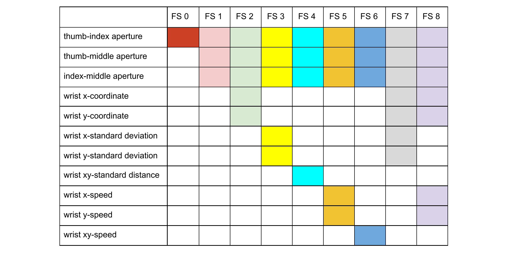
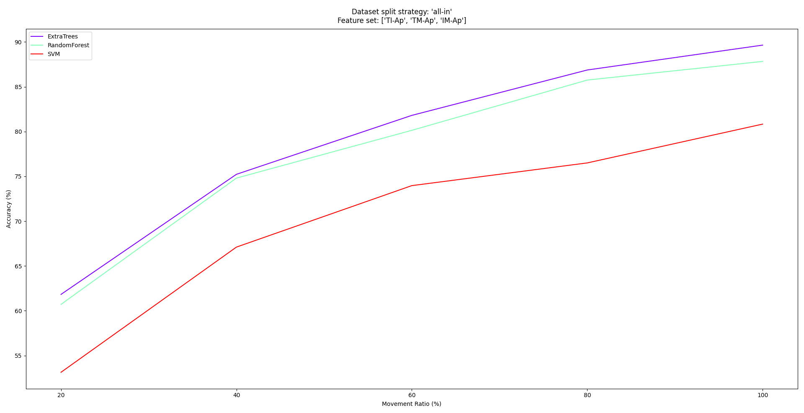
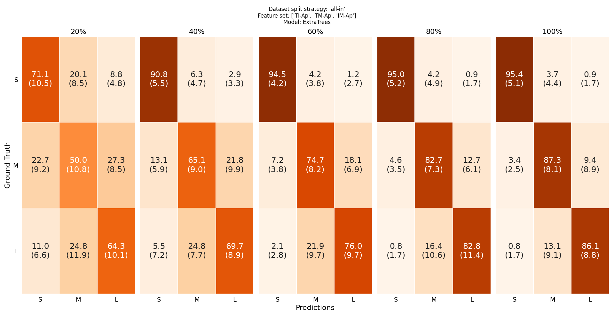
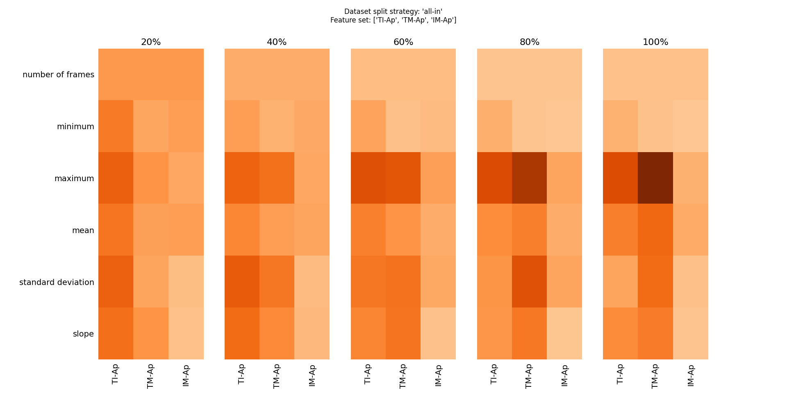
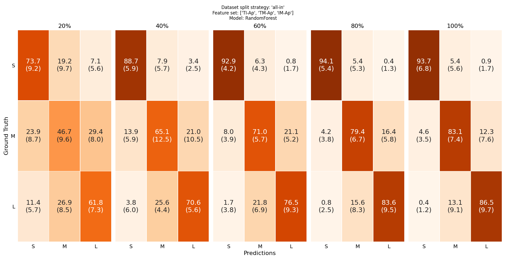

# Implementation Details

## Dependencies
- Python version: >= 3.3

This repository has also the following package dependencies:
- numpy
- pandas
- scipy
- seaborn
- matplotlib
- scikit_learn

The versions of the packages are in the ***requirements.txt*** file.

## How to run the evaluation script ?
In order to print the help menu of the evaluation script, run the following command:
```python
python3 evaluate_ml.py --help #or
python3 evaluate_ml.py -h
```

The help menu that is printed is the following:
```
usage: evaluate_ml.py [--feature_sets {0,1,2,3,4,5,6,7,8} [{0,1,2,3,4,5,6,7,8} ...]] [--methods {RandomForest,GradientBoosting,ExtraTrees,SVM,GaussianProcess} [{RandomForest,GradientBoosting,ExtraTrees,SVM,GaussianProcess} ...]] [--plot] [--seed SEED] [-h] {all-in,one-out}

positional arguments:
  {all-in,one-out}      The dataset split strategy to be used.

optional arguments:
  --feature_sets {0,1,2,3,4,5,6,7,8} [{0,1,2,3,4,5,6,7,8} ...]
                        The feature sets that will be used in order to produce the kinematic features of the grasping movement.
  --methods {RandomForest,GradientBoosting,ExtraTrees,SVM,GaussianProcess} [{RandomForest,GradientBoosting,ExtraTrees,SVM,GaussianProcess} ...]
                        The methods that will be used in order to train and evaluate the model.
  --plot                Plot the accuracries of the different methods superimposed, the confusion matrices of each method and the feature importances of the Extra Trees model (if ET is one of the given models).
  --seed SEED           A seed to initialize the random generator.
  -h, --help            Show this help message and exit.
```

## Dataset Split Strategy
As specificied in the help menu above, the user has to select the dataset split strategy to be used. The dataset split strategies are the following:
- all-in
- one-out

```python
python3 evaluate_ml.py all-in   #Run the evaluation script for the 'all-in' dataset split strategy.
python3 evaluate_ml.py one-out  #Run the evaluation script for the 'one-out' dataset split strategy.
```

### Methods
In the previous cases, the script will output the results of all the methods:
- RandomForest
- GradientBoosting
- ExtraTrees
- SVM
- GaussianProcess

for each of all the following feature sets.

## Feature Sets
The kinematic features that are engineered for each feature set are the following:
<p align="center">
</img>
</p>

It is possible to specify a subset of methods and feature sets for which the models will be evaluated.

e.g.
```python
python3 evaluate_ml.py one-out --feature_sets 5 3 1
python3 evaluate_ml.py one-out --methods ExtraTrees RandomForest SVM 
python3 evaluate_ml.py all-in --feature_sets 5 3 1 --methods ExtraTrees RandomForest SVM
```
## Results Format
The results are printed in the following format:
```
python3 evaluate_ml.py all-in --feature_sets 5 3 1 --methods ExtraTrees RandomForest SVM
```

```
Dataset split strategy: 'all-in'
feature set: 1 ['TI-Ap', 'TM-Ap', 'IM-Ap']
                     20          40          60          80          100
ExtraTrees    61.8 (4.9)  75.2 (4.6)  81.8 (2.9)  86.9 (3.9)  89.6 (1.9)
RandomForest  60.7 (3.5)  74.8 (4.9)  80.1 (3.6)  85.7 (3.5)  87.8 (2.7)
SVM           53.1 (4.0)  67.1 (5.9)  74.0 (4.8)  76.5 (3.5)  80.8 (3.7)

Dataset split strategy: 'all-in'
feature set: 3 ['TI-Ap', 'TM-Ap', 'IM-Ap', 'wrist x-std_dev', 'wrist y-std_dev']
                     20          40          60          80          100
ExtraTrees    64.8 (2.6)  80.1 (3.9)  84.8 (5.1)  86.3 (2.3)  91.6 (2.5)
RandomForest  62.5 (3.4)  78.6 (3.0)  82.1 (4.7)  86.8 (3.7)  89.2 (2.9)
SVM           56.8 (4.8)  70.3 (4.8)  74.3 (4.8)  76.6 (3.3)  80.4 (4.0)

Dataset split strategy: 'all-in'
feature set: 5 ['TI-Ap', 'TM-Ap', 'IM-Ap', 'wrist x-speed', 'wrist y-speed']
                     20          40          60          80          100
ExtraTrees    61.8 (5.4)  77.3 (4.4)  82.7 (4.5)  86.0 (3.6)  90.6 (2.8)
RandomForest  60.7 (4.9)  75.6 (6.3)  81.1 (5.4)  84.7 (4.0)  89.2 (3.7)
SVM           36.9 (4.7)  45.5 (8.1)  53.1 (6.6)  61.3 (4.3)  59.4 (6.2)
```

For each method, movement completion percentage and feature set combination, the floating point numbers indicate the mean and the standard deviation of the model's accuracy rates in the k-fold evaluation scheme.

<b>Note I:</b> The models' accuracy results will NOT be the same for two executions of the evaluation script with the same arguments unless a seed is provided. 

<b>Note II:</b> The feature sets 1 and 2 are the workspace-independent (Ws-I) and the workspace-dependent (Ws-D) feature sets, respectively as presented in the paper.
## Plotting the results
It is possible to plot the accuracy results and the confusion matrices of the models interactively, as well as the feature importances of the Extra Trees model.

Each confusion matrix has a 3x3 shape and was calculated as the average of k confusion matrices in the k-fold evaluation scheme. The floating point number outside the parentheses indicates the average accuracy for a (ground-truth label, predicted class) combination. On the other hand, the floating point number inside the parentheses indicates the standard deviation of the k accuracies for a (ground-truth label, predicted class) combination.

The feature importances are calculated based on the Gini criterion for the Extra Trees model. 

The user can choose the feature set and the method for which the plots are drawn interactively, using the arrow keys:
- the 'up' and 'down' arrow keys are used to change the feature set
- the 'right' and 'left' arrow keys are used to change the method

e.g.
```
python3 evaluate_ml.py all-in --feature_sets 5 3 1 --methods ExtraTrees RandomForest SVM --plot
```

Initally the following figures are plotted:

<p align="center">
</img>
</p>

<p align="center">
</img>
</p>

<p align="center">
</img>
</p>

After pressing the 'right' key, the confusion matrices' figure is updated:

<p align="center">
</img>
</p>

After pressing the 'up' key, both the accuracy and the confusion matrices figures are updated:

<p align="center">
</img>
</p>

<p align="center">
</img>
</p>

<p align="center">
</img>
</p>

The program terminates when the user closes one of the figures.

## How to reproduce the results of the paper?
Seed the random generator with 0.
```
python3 evaluate_ml.py all-in --methods ExtraTrees --feature_set 1 2  --seed 0
python3 evaluate_ml.py one-out --methods SVM --feature_set 1 2 --seed 0
```

<b>Note:</b> The results may vary (slightly) across different OSs, since the the *random_state* parameter of Scikit-learn produces deterministic results on a specific OS, but does not produce the same results on different OSs. Check also [here](https://github.com/lmcinnes/umap/issues/153).