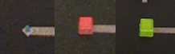
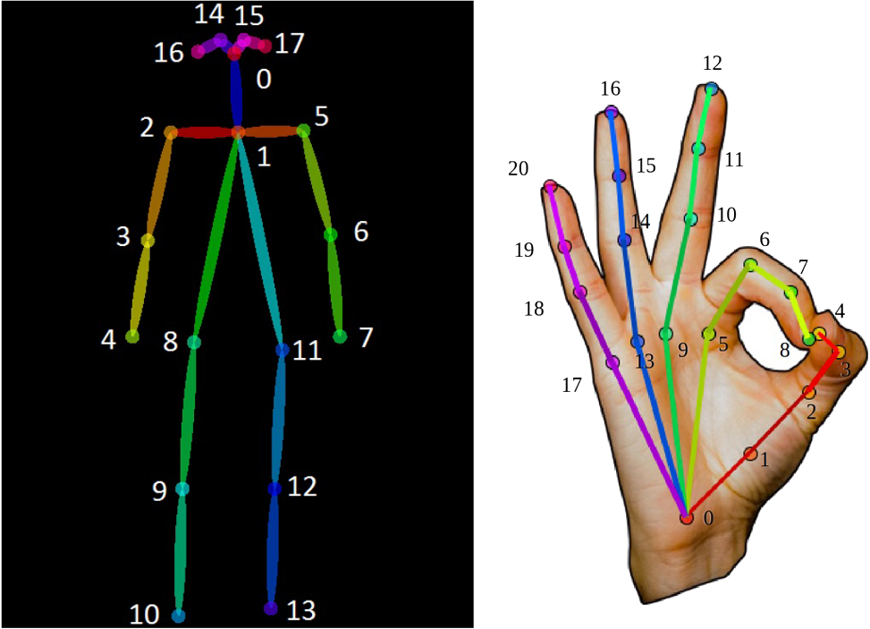

# Dataset Description

During the data collection process, each participant reached, grasped, picked up, and moved a cubic object. The movements were recorded with an ASUS Xtion pro RGB-D camera. The raw RGB information was used to track the human wrist  and human hand joints' positions via [OpenPose](https://github.com/CMU-Perceptual-Computing-Lab/openpose) [Cao, Z., Hidalgo Martinez, G., Simon, T., Wei, S., Sheikh, Y.A.: OpenPose: Realtime Multi-Person 2D Pose Estimation using Part Affinity Fields. IEEE Transactions on Pattern Analysis and Machine Intelligence]. The publicly available dataset contains the OpenPose skeletal data for each frame of the movements. The data collection process is described in more detail in Section 3.1. of the paper. 
## Participants

The dataset's movements were performed by **8 participants**:
- P1
- P2
- P3
- P4
- P5
- P6
- P7
- P8

All the movements that were performed by a participant are listed in the corresponding directory. <br/>
e.g. All the movements that were performed by the P4 participant are listed in the P4 directory. <br/><br/>

## Objects

Each participant reached for **3 objects**:
* a small-sized cube with a 2.5 cm edge length (S)
* a medium-sized cube with a 5.5 cm edge lenth (M)    
* a large-sized cube with a 7.5 cm edge length (L) 

<p align="center">
</img>
</p>

The blue cube is the small object, the red cube is the medium object and the green cube is the large object. <br/> <br/>

## Total Recorded Movements

Each participant reached for each of the small, the medium and the large object 30 times. Therefore:
- 30 movements were recorded for each (participant, object) pair,
- 90 movements were recorded for each participant and
- 720 movements were recorded in total. <br/><br/>

## Dataset Organization

The files are organized in eight directories *Pi*, with *i=1,...,8*, one for each participant. 

The name of each  file indicates the **participant's pseudonym** *Pi*, the **object's size** (*S, M, L*) and the **ordinal number** of the participant's movement towards the object (*from 01 to 30*).

e.g. P4/P4_L_09.csv is the 9th movement of the participant P4 towards the large object.

## Excluded Movements

Out of these 720 movements, 5 movements in which the data collection was problematic were identified and excluded from the dataset. Specifically, the following files were excluded from the dataset:
* P2_S_15.csv
* P4_M_07.csv
* P5_L_03.csv
* P8_M_03.csv
* P8_L_01.csv

As a result, the final dataset consists of **715 movements**. <br/><br/>

## Skeletal data

Each file of the dataset contains the skeletal data of the participant. The skeletal data was extracted using the **OpenPose** framework. The OpenPose framework was used to estimate the 2D locations of 18 body joints and 42 hand joints (21 hand joints for each of the left and the right hand). Each file contains only the joints of the upper body and of the hands. Specifically, the coordinates of only the following joints are included in the dataset:
* the neck (Neck) and the mid-hip (MidHip) full body joints
* the left shoulder (LShoulder), the left elbow (LElbow) and the left wrist (LWrist) full body joints
* the right shoulder (RShoulder), the right elbow (RElbow) and the right wrist (RWrist) full body joints
* the right hand joints
* the left hand joints

Therefore, 50 joints are listed in total in each csv file:
* 8 full body joints
* 21 right hand joints
* 21 left hand joints
<br/><br/>

<p align="center">
</img>
</p>

The following names are used to refer to the corresponding joints of the images above:

| OpenPose Joint             | Dataset Name                           | 
| -------------------------- | ---------------------------------------|
| Full Body -  0             | Neck                                   |
| Full Body -  1             | MidHip                                 |
| Full Body -  2             | LShoulder                              |
| Full Body -  3             | LElbow                                 |
| Full Body -  4             | LWrist                                 |
| Full Body -  5             | RShoulder                              |
| Full Body -  6             | RElbow                                 |
| Full Body -  7             | RWrist                                 |
| Right/Left Hand - 0        | RPalmBase / LPalmBase                  |
| Right/Left Hand - 1        | RThumb1CMC / LThumb1CMC                |
| Right/Left Hand - 2        | RThumb2Knuckles / LThumb2Knuckles      |
| Right/Left Hand - 3        | RThumb3IP / LThumb3IP                  |
| Right/Left Hand - 4        | RThumb4FingerTip / LThumb4FingerTip    |
| Right/Left Hand - 5        | RIndex1Knuckles / LIndex1Knuckles      |
| Right/Left Hand - 6        | RIndex2PIP / LIndex2PIP                |
| Right/Left Hand - 7        | RIndex3DIP / LIndex3DIP                |
| Right/Left Hand - 8        | RIndex4FingerTip / LIndex4FingerTip    |
| Right/Left Hand - 9        | RMiddle1Knuckles / LMiddle1Knuckles    |
| Right/Left Hand - 10       | RMiddle2PIP / LMiddle2PIP              |
| Right/Left Hand - 11       | RMiddle3DIP / LMiddle3DIP              |
| Right/Left Hand - 12       | RMiddle4FingerTip / LMiddle4FingerTip  |
| Right/Left Hand - 13       | RRing1Knuckles / LRing1Knuckles        |
| Right/Left Hand - 14       | RRing2PIP / LRing2PIP                  |
| Right/Left Hand - 15       | RRing3DIP / LRing3DIP                  |
| Right/Left Hand - 16       | RRing4FingerTip / LRing4FingerTip      |
| Right/Left Hand - 17       | RPinky1Knuckles / LPinky1Knuckles      |
| Right/Left Hand - 18       | RPinky2PIP / LPinky2PIP                |
| Right/Left Hand - 19       | RPinky3DIP / LPinky3DIP                |
| Right/Left Hand - 20       | RPinky4FingerTip / LPinky4FingerTip    |
<br/>

Apart from the **x** and **y** coordinates of a joint, OpenPose also outputs a probability (**prob**) as the confidence value of the estimated location of the joint. For each of the joint detections, the x- and y-coordinates and the probability are listed in the csv files. In case OpenPose fails to predict the position of a joint for a frame, the x,y and prob values of the joint are set to 0 for this frame. <br/>
e.g. the RShoulder.x column contains the x-coordinates of the RShoulder joint for each frame of the recorded movement.<br/>

Finally, each file contains a "Time" column. In this column, the elapsed time from the first recorded frame of the movement is listed for each frame. For the first frame, the time is always set to 0. The elapsed time is measured in seconds. <br/><br/>

In conclusion, each file contains 151 columns:
- 3 columns (x,y,prob) for each of the 50 joints
- an extra "Time" column

Each row corresponds to a frame of the recorded movement.

## R-t-G Movements
The onset and the end of the R-t-G part of the movements is provided in the ***RtG_onset_end.csv*** for each of the 715 movements of the dataset. If the timestamp of a frame  is greater than or equal to the R-t-G movement onset and less than or equal to the R-t-G movement end, then this frame is part of the R-t-G movement. The R-t-G movement onset and end are extracted as described in Section 3.2. of the paper.

# Citation
Please cite this paper in your publications if you use this dataset for your research:

```
@inproceedings{dagioglou22obj,
      author = {Maria Dagioglou and Nikolaos Soulounias and Theodoros Giannakopoulos},
      booktitle = {24th International Conference on Human-Computer Interaction},
      organization={Springer},
      title = {Object Size Prediction from Hand Movement Using a Single RGB Sensor},
      year = {2022}
    }
```