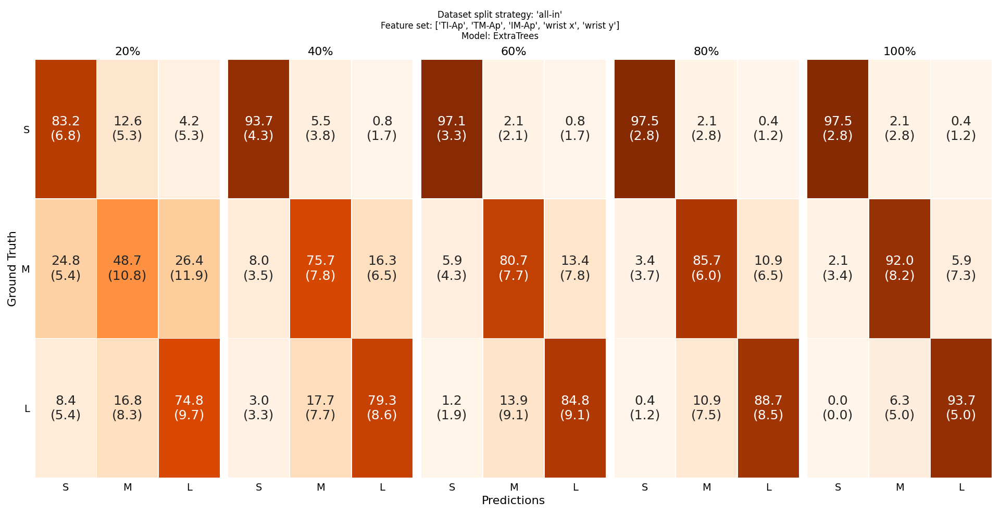
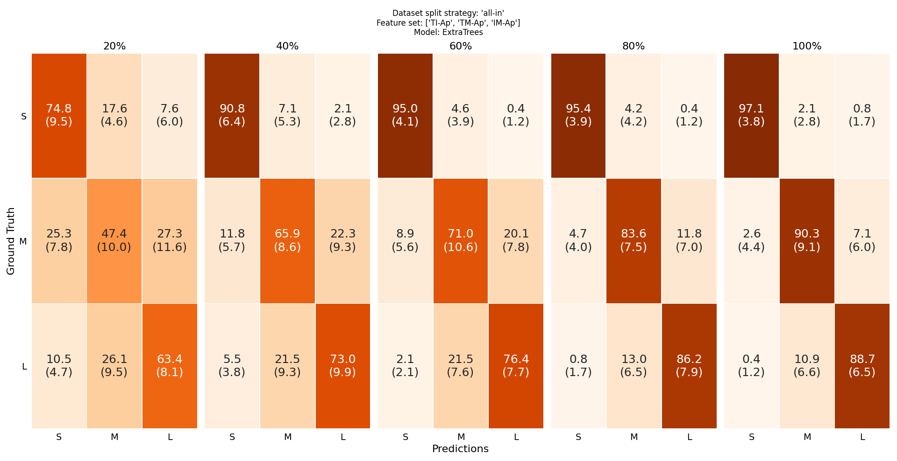
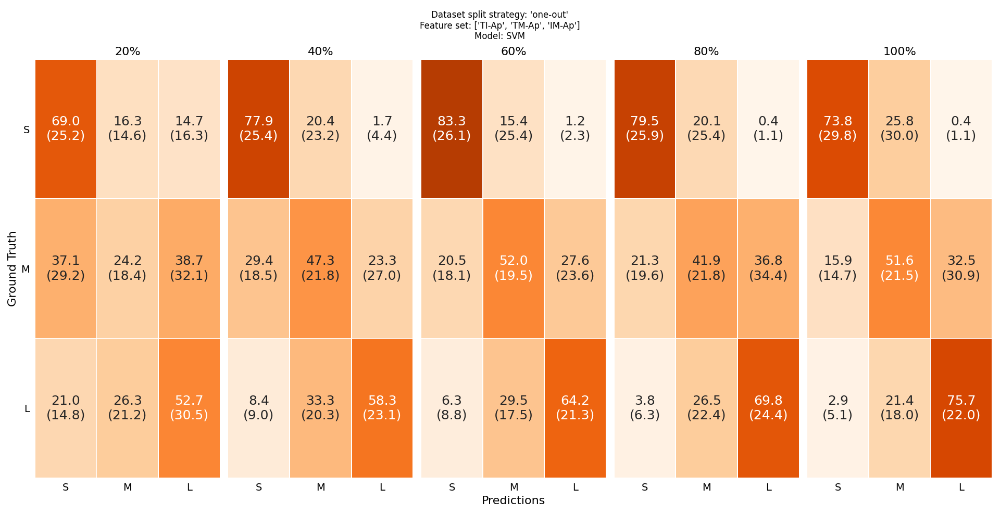
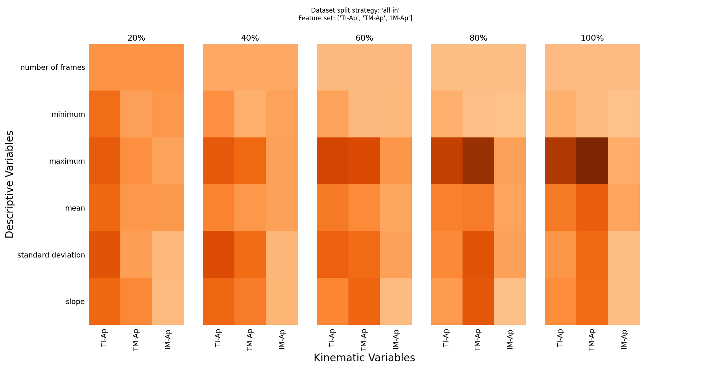

# Supplemental Material
This directory contains the supplemental material of the paper "Object size prediction from hand movement using a single RGB sensor". Namely, the following information is presented below:
- the confusion matrices for each movement completion interval (20%, 40%, 60%, 80%, 100%), feature set (Ws-D, Ws-I) and data-split strategy (all-in, one-out).
- the feature importance heatmaps for each movement completion interval (20%, 40%, 60%, 80%, 100%) and feature set (Ws-D, Ws-I), as computed for the ET model and the "all-in" data split.
- the progression of each kinematic variable (TI-Ap, TM-Ap, IM-Ap, Wrist x-coordinate, Wrist y-coordinate) over the R-t-G movement.
- the accuracy boxlots for each movement completion interval (20%, 40%, 60%, 80%, 100%), feature set (Ws-D, Ws-I) and data-split strategy (all-in, one-out).
- a table containing the average and the standard deviation of the accuracy rates for each movement completion interval (20%, 40%, 60%, 80%, 100%), feature set (Ws-D, Ws-I) and data-split strategy (all-in, one-out).

## Confusion Matrices

    "all-in" data split
    Ws-D feature set

</img>

    "all-in" data split
    Ws-I feature set

</img>

    "one-out" data split
    Ws-D feature set

</img>

    "one-out" data split
    Ws-I feature set

</img>

## Feature Importances

    Ws-D feature set

</img>

    Ws-I feature set

</img>

## Kinematic Variables
    
    Finger Apertures (TI-Ap, TM-Ap, IM-Ap) Kinematic Variables

</img>

    Wrist x-/y- Pixel Coordinates Kinematic Variables

</img>

## 

## Results

The average and the standard deviation (in parentheses) of the accuracy rates for each of the movement completion intervals (20%, 40%, 60%, 80%, 100%), data split strategies (all-in, one-out) and feature sets (Ws-D, Ws-I), as presented in Section 4 of the paper. 

| Data Split        | Workspace Dependency  |  20%        | 40%         | 60%         | 80%         | 100%        |
| ------------------|-----------------------|-------------|-------------|-------------|-------------|-------------|
| all-in            | Ws-D                  | 68.4 (3.9)  | 81.5 (2.8)  | 87.3 (3.1)  | 91.3 (3.8)  | 94.3 (2.1)  |
| all-in            | Ws-I                  | 60.7 (5.7)  | 77.5 (4.3)  | 81.8 (4.0)  | 87.7 (3.6)  | 90.8 (2.9)  |
| one-out           | Ws-D                  | 44.0 (12.9) | 55.1 (14.6) | 56.5 (14.4) | 62.2 (15.4) | 67.1 (13.7) |
| one-out           | Ws-I                  | 48.9 (12.1) | 61.3 (8.9)  | 66.6 (9.2)  | 63.8 (11.5) | 67.1 (15.0) |